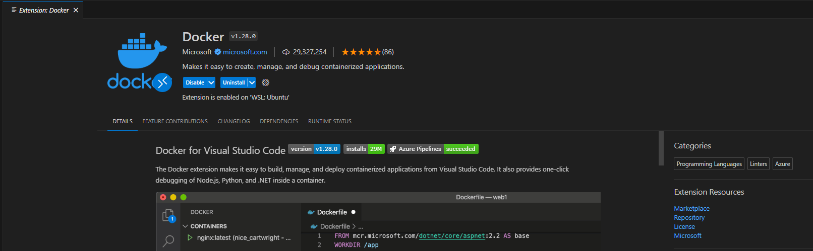
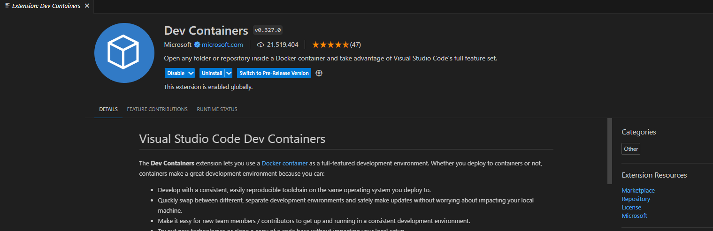
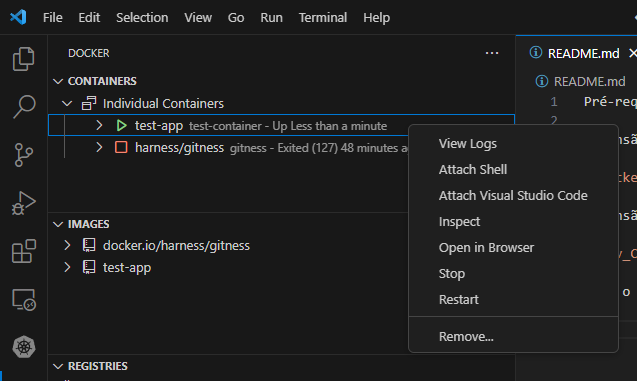
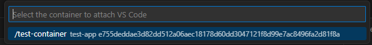
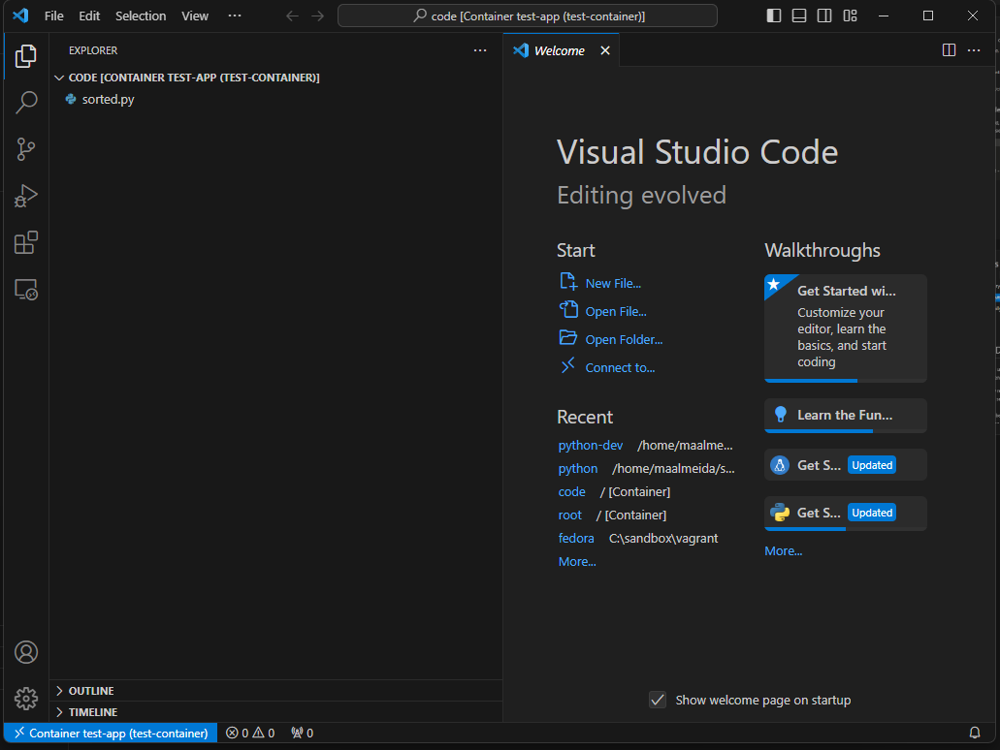

Pré-requisitos:

Extensão Docker:



Extensão Dev Containers:



Suba o container de teste com ```./run.sh```

Botão direito no container test-app.



Selecione a opção "Attach Visual Studio Code".



Selecione /test-container



Tudo pronto para você começar a desenvolver dentro do container.

Comece instalando a extensão Python e outras extensões necessárias para o desenvolvimento.

